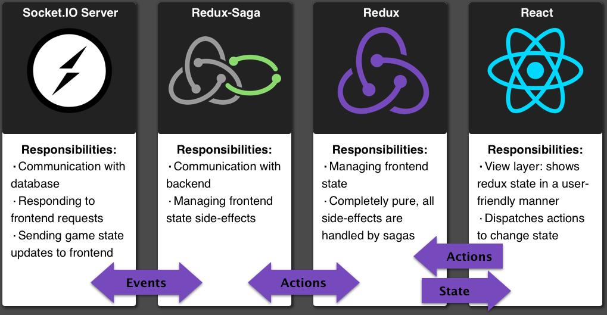

# WordGrid

A realtime web-based word game built using React, Redux and Socket.io.

## Motivation
A friend of mine and I often play an iOS game very similar to WordGrid. I wanted to have a web-based version so that it could be played from anywhere and thought this was a good opportunity to practice my React skills.

## Goals of this project
1. Shall work well on both desktop and mobile.
2. To learn Redux and Redux-Saga.
3. To learn Socket.io.
4. Create a maintainable, accessible, and expandable game.

## Stack

## Challenges
While working on this project, I faced a few challenges. 

Firstly, creating a grid of letters that can be selected to create a word that works across desktop and mobile. I decided to create the grid using DOM elements instead of canvas for two reasons: it would be easier to make responsive, and my game was rather simple to render, using canvas rendering would add complexity. When researching how I would accomplish this, I came across the pointer events API, which seemed like it would fit my use-case perfectly. Unfortunately, it wasn't as simple as building it on a desktop browser and having it magically work on mobile. `pointerenter` and `pointerleave` didn't behave the same on mobile and desktop (at least on iOS 12 using the PEP polyfill), so I ended up having to implement touch event listeners which have a different API. 

Secondly, I wasn't very experienced with using databases (I've been spoiled by Django's ORM). I knew that I wanted this project to be realtime and use socket.io or websockets to communicate between the server and client. I had heard of rethinkdb in the past and thought it would be a perfect fit. Unfortunately, its support is iffy at-best currently, and I wasn't even able to install it on an Ubuntu server due to outdated security certificates. Instead, I decided to use postgres which required a fair amount of refactoring since the two databases are extremely different. In the future to avoid this, I will take maintainership more into consideration, as well as deploying as early as possible to avoid a lot of refactoring.

Lastly, I had never used Redux before, let alone a side-effect manager such as redux-saga. Learning Redux wasn't terribly difficult, there were plenty of resources and in the end, Redux is a tiny library. Redux-saga on the other hand, was a bit more difficult. It has a rather large number of effects and I had a hard time wrapping my head around composing sagas together, especially in relation to authentication. Now that my sagas are written and I have a grasp of the library, I really love how idiomatic the code is, plus having all of my socket communication isolated to sockets was extremely helpful when debugging.

## Next Steps

 - Lobbies
 - Persistant accounts
 - Leaderboards
 - Multiple gamemodes
 - Leaderboards
 - Improvements to board generation
 
## Contributing
At the moment I'm not looking for any code contributions. I spent a long time working on this project and would like to be the sole maintainer to show to potential employers. If you are interested in hiring me, please send me an email at egroom@mail.sfsu.edu
